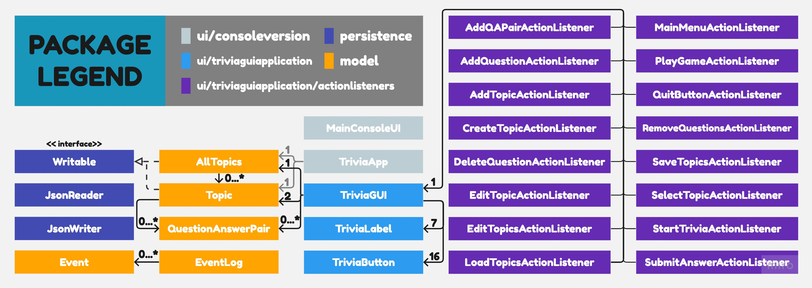

# Personal Trivia Project

## Pre-planning
### Key Idea: Trivia Game / Tool
- **All code** will be written in Java
- The main concept is a trivia application with the option to answer questions *from the player's chosen topic*

### What will the application do?
- The program will ask the user for certain information (name, trivia topic)
- The output log will present questions in the chosen topic
- When the user answers a question, the output log will print correct/incorrect and then print another question

### Who will use it?
- The application can be used for anyone looking to test their knowledge in a certain topic
- Additionally, it can be used by individuals to learn something new in the chosen topic

### Why is this project of interest to you?
##### It allows me to combine my areas of interest:
- education / acquisition of knowledge
- various fields of knowledge as quiz topics (ex. music, math, physics, etc.)
- creates a fun learning tool that can be used by not only others but myself as well

### What are some of the classes that may be involved?
- questions/answer pairs, each of them being strings
- topics, which wil consist of a string for the name, and an arbitrary number of our previously mentioned q/a pairs
- need to represent tests, main method to run the application

### Does this fit within our restrictions?
- All data (mainly topics and questions) will be included within the project.
- No use of external applications is required
- No absolute paths will be used
- It is not a To-Do list (nor is it similar to one)

### User stories
- As a user, I want to be able to add any amount of questions/answer pairs to topic
- As a user, I want to be able to add any number of topics to the Trivia game
- As a user, I want to be able to view the list of all existing topics
- As a user, I want to be able to view the questions within any topic(s)
- As a user, I want to be able to remove question/answer pairs from any topic(s)
- As a user, I want to set my name
- As a user, I want to be able to play the Trivia game with a topic of my choice
- As a user, I want to see my score once I've completed answering the questions within a topic

### Additional User Stories
- As a user, when I'm in the main menu, I want to have the option to save my changes to the topics and questions
- As a user, when I start the application, I want to be given the option to load my previous topics and questions

### Additional Information
- You can generate the first required action related to adding Xs to a Y by clicking Load Topics -> Edit Topics -> Edit Topic -> Select Topic -> Add Questions 
- You can generate the second required action related to adding Xs to a Y by clicking Load Topics -> Edit Topics -> Edit Topic -> Select Topic -> Remove Questions
- You can locate my visual component by launching the app or heading to the main menu
- You can save the state of my application by clicking save topics on the main menu
- You can reload the state of my application by clicking load topics on the main menu

### *Sample Event Log Output*

Trivia Application Event Log:\
Thu Nov 30 22:34:15 PST 2023\
New topic Test Topic 1 created.\
Thu Nov 30 22:34:20 PST 2023\
New topic Test Topic 2 created.\
Thu Nov 30 22:34:30 PST 2023\
Question Answer Pair added to Test Topic 1.\
Thu Nov 30 22:34:36 PST 2023\
Question Answer Pair added to Test Topic 1.\
Thu Nov 30 22:34:44 PST 2023\
List of all questions in topic Test Topic 1 displayed.\
Thu Nov 30 22:34:46 PST 2023\
Question Answer Pair deleted from Test Topic 1.\
Thu Nov 30 22:34:46 PST 2023\
List of all questions in topic Test Topic 1 displayed.\
Thu Nov 30 22:34:53 PST 2023\
List of all questions in topic Test Topic 1 displayed.

### Final Reflection

The design presented in my UML is fairly simple to understand, however there is a lot of repeated elements (ex. 16 action listener classes that each have a field of TriviaGUI).

### Potential refactoring:
- Create separate classes to manage different panels in my GUI 
- Create a panel switching class
- Change AllTopics to be a singleton and act like a "TopicStorage"
- Add systematic exception handling rather than error messages

For example, I could create separate classes that represent each panel 
(ex. TriviaMainMenuPanel, TriviaPlayScreenPanel, etc.) all of which extend 
the common functionality of an abstract class "TriviaPanel". This would allow 
the TriviaGUI class to handle frame-related actions and not have to set up panels 
within the class. A large portion of refactoring that could be performed in this project
is extracting repeated process to be handled by separate methods or classes

